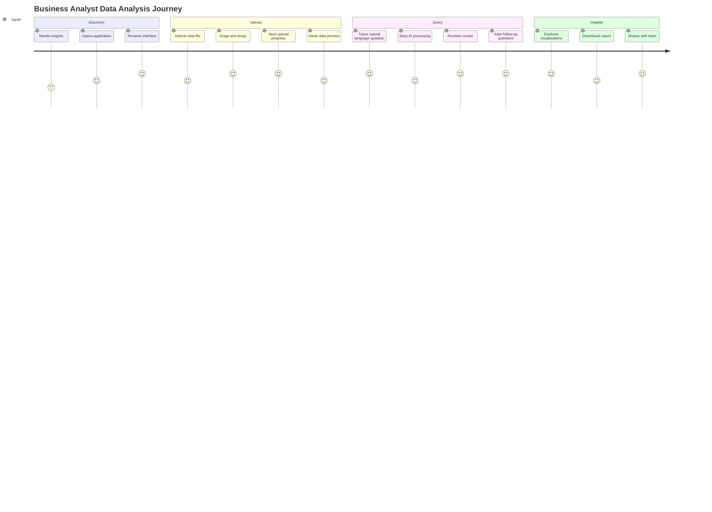
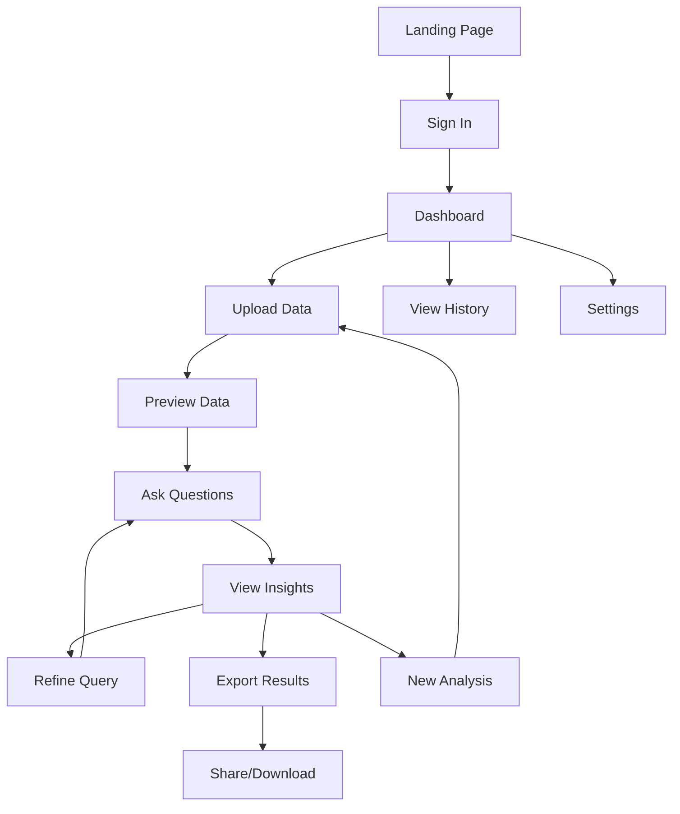

# UX/UI FLOW DESIGN
# Enterprise Insights Copilot - User Experience & Interface Design

## OVERVIEW

This document defines the complete user experience and interface design for the Enterprise Insights Copilot. It focuses on creating an intuitive, efficient, and delightful experience for business users analyzing data through AI-powered insights.

## USER PERSONAS & JOURNEY MAPPING

### Primary Personas

**1. Business Analyst (Sarah)**
- **Role**: Data analyst at mid-size company
- **Goals**: Quick insights from sales/financial data
- **Pain Points**: Complex tools, slow analysis, unclear results
- **Tech Comfort**: Medium (familiar with Excel, basic BI tools)

**2. Executive (Michael)**
- **Role**: VP of Operations
- **Goals**: High-level trends and actionable insights
- **Pain Points**: Too much detail, wants executive summaries
- **Tech Comfort**: Low (prefers simple, visual interfaces)

**3. Data Scientist (Priya)**
- **Role**: Senior data scientist
- **Goals**: Advanced analytics and custom queries
- **Pain Points**: Limited by rigid tools, wants flexibility
- **Tech Comfort**: High (comfortable with code, APIs)

### User Journey Mapping


## INFORMATION ARCHITECTURE

### App Structure
```
Enterprise Insights Copilot
├── Landing Page
├── Authentication
├── Dashboard (Main Interface)
│   ├── File Upload Zone
│   ├── Data Preview Panel
│   ├── Query Interface
│   ├── Results & Insights Panel
│   ├── Conversation History
│   └── Export Options
├── History & Sessions
├── Settings & Preferences
└── Help & Documentation
```

### Navigation Flow


## DETAILED UI/UX FLOWS

### 1. ONBOARDING FLOW

**Step 1: Welcome & Value Proposition**
```jsx
// Landing Page Component
const LandingPage = () => {
  return (
    <div className="min-h-screen bg-gradient-to-br from-blue-50 to-indigo-100">
      <Hero>
        <h1 className="text-5xl font-bold text-gray-900 mb-6">
          Transform Your Data Into Actionable Insights
        </h1>
        <p className="text-xl text-gray-600 mb-8">
          Upload your data, ask questions in plain English, 
          and get AI-powered business insights in seconds.
        </p>
        <DemoVideo />
        <CTAButton>Start Analyzing Your Data</CTAButton>
      </Hero>
      
      <Features>
        <FeatureCard 
          icon="📊" 
          title="Natural Language Queries"
          description="Ask questions like 'What are our top performing products?'"
        />
        <FeatureCard 
          icon="🤖" 
          title="AI-Powered Analysis"
          description="Advanced algorithms analyze patterns and trends automatically"
        />
        <FeatureCard 
          icon="📈" 
          title="Interactive Visualizations"
          description="Dynamic charts and graphs that tell your data's story"
        />
      </Features>
    </div>
  )
}
```

**Step 2: Quick Start Tutorial**
```jsx
const OnboardingTutorial = () => {
  const [currentStep, setCurrentStep] = useState(0)
  
  const steps = [
    {
      title: "Upload Your Data",
      description: "Drag and drop CSV files or connect to databases",
      demo: <FileUploadDemo />
    },
    {
      title: "Ask Questions",
      description: "Type questions in natural language",
      demo: <QueryDemo />
    },
    {
      title: "Get Insights",
      description: "View AI-generated analysis and visualizations",
      demo: <InsightsDemo />
    }
  ]
  
  return (
    <TutorialModal>
      <ProgressBar current={currentStep} total={steps.length} />
      <StepContent step={steps[currentStep]} />
      <NavigationButtons 
        onNext={() => setCurrentStep(prev => prev + 1)}
        onSkip={() => router.push('/dashboard')}
      />
    </TutorialModal>
  )
}
```

### 2. FILE UPLOAD FLOW

**State Management for Upload Process**
```jsx
const FileUploadFlow = () => {
  const [uploadState, setUploadState] = useState('idle') // idle, uploading, processing, complete, error
  const [uploadProgress, setUploadProgress] = useState(0)
  const [fileMetadata, setFileMetadata] = useState(null)
  const [previewData, setPreviewData] = useState(null)
  const [validationErrors, setValidationErrors] = useState([])
  
  const handleFileUpload = async (file) => {
    setUploadState('uploading')
    
    try {
      // Upload with progress tracking
      const result = await uploadWithProgress(file, (progress) => {
        setUploadProgress(progress)
      })
      
      setUploadState('processing')
      setFileMetadata(result.metadata)
      
      // Generate preview
      const preview = await generatePreview(result.fileId)
      setPreviewData(preview)
      
      setUploadState('complete')
      
    } catch (error) {
      setUploadState('error')
      setValidationErrors(error.validationErrors || [])
    }
  }
  
  return (
    <div className="w-full max-w-4xl mx-auto">
      {uploadState === 'idle' && <FileDropZone onUpload={handleFileUpload} />}
      {uploadState === 'uploading' && <UploadProgress progress={uploadProgress} />}
      {uploadState === 'processing' && <ProcessingAnimation />}
      {uploadState === 'complete' && <DataPreview data={previewData} metadata={fileMetadata} />}
      {uploadState === 'error' && <ErrorDisplay errors={validationErrors} onRetry={() => setUploadState('idle')} />}
    </div>
  )
}
```

**Enhanced File Drop Zone**
```jsx
const FileDropZone = ({ onUpload }) => {
  const [isDragOver, setIsDragOver] = useState(false)
  const [fileValidation, setFileValidation] = useState(null)
  
  return (
    <div 
      className={`
        border-2 border-dashed rounded-lg p-12 text-center transition-all duration-200
        ${isDragOver 
          ? 'border-blue-500 bg-blue-50 scale-105' 
          : 'border-gray-300 hover:border-gray-400'
        }
      `}
      onDragOver={(e) => {
        e.preventDefault()
        setIsDragOver(true)
      }}
      onDragLeave={() => setIsDragOver(false)}
      onDrop={(e) => {
        e.preventDefault()
        setIsDragOver(false)
        const files = Array.from(e.dataTransfer.files)
        handleFileValidation(files[0])
      }}
    >
      <div className="space-y-4">
        <div className="text-6xl">{isDragOver ? '📥' : '📊'}</div>
        <div>
          <h3 className="text-xl font-semibold text-gray-900">
            {isDragOver ? 'Drop your file here' : 'Upload your data file'}
          </h3>
          <p className="text-gray-600 mt-2">
            Supports CSV, Excel (.xlsx), and JSON files up to 50MB
          </p>
        </div>
        
        <div className="flex justify-center space-x-4">
          <FileInput onSelect={handleFileValidation} />
          <SampleDataButton />
        </div>
        
        <div className="text-sm text-gray-500">
          <SecurityBadge text="Your data is processed securely and deleted after 24 hours" />
        </div>
      </div>
    </div>
  )
}
```

### 3. DATA PREVIEW & EXPLORATION FLOW

**Interactive Data Preview**
```jsx
const DataPreview = ({ data, metadata }) => {
  const [viewMode, setViewMode] = useState('table') // table, summary, sample
  const [selectedColumns, setSelectedColumns] = useState(new Set())
  const [filters, setFilters] = useState({})
  
  return (
    <div className="bg-white rounded-lg shadow-lg p-6">
      <PreviewHeader metadata={metadata} />
      
      <ViewModeSelector 
        mode={viewMode} 
        onChange={setViewMode}
        options={[
          { value: 'table', label: 'Data Table', icon: '📋' },
          { value: 'summary', label: 'Summary Stats', icon: '📊' },
          { value: 'sample', label: 'Sample Rows', icon: '🔍' }
        ]}
      />
      
      {viewMode === 'table' && (
        <InteractiveDataTable 
          data={data}
          selectedColumns={selectedColumns}
          onColumnSelect={setSelectedColumns}
          filters={filters}
          onFilterChange={setFilters}
        />
      )}
      
      {viewMode === 'summary' && (
        <SummaryStatistics data={data} />
      )}
      
      {viewMode === 'sample' && (
        <SampleDataView data={data.slice(0, 10)} />
      )}
      
      <ActionButtons>
        <Button variant="primary" onClick={() => proceedToQuery()}>
          Start Asking Questions
        </Button>
        <Button variant="secondary" onClick={() => downloadSample()}>
          Download Sample
        </Button>
      </ActionButtons>
    </div>
  )
}
```

### 4. QUERY INTERFACE FLOW

**Conversational Query Interface**
```jsx
const QueryInterface = ({ fileData }) => {
  const [query, setQuery] = useState('')
  const [conversation, setConversation] = useState([])
  const [isProcessing, setIsProcessing] = useState(false)
  const [suggestions, setSuggestions] = useState([])
  
  useEffect(() => {
    // Generate smart suggestions based on data
    generateSmartSuggestions(fileData).then(setSuggestions)
  }, [fileData])
  
  const handleSubmitQuery = async (queryText) => {
    setIsProcessing(true)
    
    const userMessage = {
      id: generateId(),
      type: 'user',
      content: queryText,
      timestamp: new Date()
    }
    
    setConversation(prev => [...prev, userMessage])
    setQuery('')
    
    try {
      const response = await submitQuery({
        query: queryText,
        fileData: fileData,
        conversationHistory: conversation
      })
      
      const assistantMessage = {
        id: generateId(),
        type: 'assistant',
        content: response.insights,
        visualizations: response.visualizations,
        followUpQuestions: response.followUpQuestions,
        timestamp: new Date()
      }
      
      setConversation(prev => [...prev, assistantMessage])
      
    } catch (error) {
      // Error handling
    } finally {
      setIsProcessing(false)
    }
  }
  
  return (
    <div className="flex flex-col h-full">
      <ConversationHistory messages={conversation} />
      
      {isProcessing && <ProcessingIndicator />}
      
      <QueryInputArea>
        <SmartSuggestions 
          suggestions={suggestions}
          onSelect={handleSubmitQuery}
        />
        
        <QueryInput 
          value={query}
          onChange={setQuery}
          onSubmit={handleSubmitQuery}
          placeholder="Ask a question about your data..."
          disabled={isProcessing}
        />
        
        <QueryHelpers>
          <ExampleQuestions fileData={fileData} onSelect={setQuery} />
          <VoiceInput onTranscript={setQuery} />
        </QueryHelpers>
      </QueryInputArea>
    </div>
  )
}
```

**Smart Query Suggestions**
```jsx
const SmartSuggestions = ({ suggestions, onSelect }) => {
  const categorizedSuggestions = useMemo(() => {
    return {
      overview: suggestions.filter(s => s.category === 'overview'),
      trends: suggestions.filter(s => s.category === 'trends'),
      comparisons: suggestions.filter(s => s.category === 'comparisons'),
      predictions: suggestions.filter(s => s.category === 'predictions')
    }
  }, [suggestions])
  
  return (
    <div className="mb-4 space-y-3">
      <h3 className="text-sm font-medium text-gray-700">Suggested questions</h3>
      
      {Object.entries(categorizedSuggestions).map(([category, items]) => (
        <SuggestionCategory key={category} title={category} items={items} onSelect={onSelect} />
      ))}
      
      <Button 
        variant="ghost" 
        size="sm"
        onClick={() => generateMoreSuggestions()}
      >
        🔄 More suggestions
      </Button>
    </div>
  )
}
```

### 5. RESULTS & INSIGHTS FLOW

**Dynamic Results Display**
```jsx
const ResultsDisplay = ({ result, onFollowUp }) => {
  const [activeTab, setActiveTab] = useState('insights')
  const [exportFormat, setExportFormat] = useState('pdf')
  
  return (
    <div className="bg-white rounded-lg shadow-lg">
      <ResultHeader result={result} />
      
      <TabNavigation 
        tabs={[
          { id: 'insights', label: 'Key Insights', icon: '💡' },
          { id: 'visualizations', label: 'Charts', icon: '📊' },
          { id: 'data', label: 'Data Table', icon: '📋' },
          { id: 'methodology', label: 'How we calculated this', icon: '🔍' }
        ]}
        activeTab={activeTab}
        onChange={setActiveTab}
      />
      
      <TabContent>
        {activeTab === 'insights' && (
          <InsightsPanel 
            insights={result.insights}
            confidence={result.confidence}
            limitations={result.limitations}
          />
        )}
        
        {activeTab === 'visualizations' && (
          <VisualizationsPanel 
            charts={result.visualizations}
            interactive={true}
          />
        )}
        
        {activeTab === 'data' && (
          <DataTablePanel 
            data={result.data}
            highlights={result.highlights}
          />
        )}
        
        {activeTab === 'methodology' && (
          <MethodologyPanel 
            steps={result.methodology}
            reasoning={result.reasoning}
          />
        )}
      </TabContent>
      
      <ResultActions>
        <FollowUpQuestions 
          questions={result.followUpQuestions}
          onSelect={onFollowUp}
        />
        
        <ExportOptions 
          format={exportFormat}
          onFormatChange={setExportFormat}
          onExport={() => exportResult(result, exportFormat)}
        />
        
        <ShareButton result={result} />
      </ResultActions>
    </div>
  )
}
```

**Interactive Visualizations**
```jsx
const InteractiveChart = ({ chartData, type, title }) => {
  const [chartOptions, setChartOptions] = useState({
    responsive: true,
    plugins: {
      legend: { position: 'top' },
      title: { display: true, text: title }
    }
  })
  
  const [viewMode, setViewMode] = useState('chart')
  
  return (
    <div className="p-4 border rounded-lg">
      <ChartHeader 
        title={title}
        viewMode={viewMode}
        onViewModeChange={setViewMode}
        onCustomize={() => openChartCustomizer()}
      />
      
      {viewMode === 'chart' && (
        <ResponsiveChart 
          type={type}
          data={chartData}
          options={chartOptions}
          onDataPointClick={handleDataPointClick}
        />
      )}
      
      {viewMode === 'table' && (
        <DataTable data={chartData} />
      )}
      
      <ChartActions>
        <Button size="sm" onClick={() => downloadChart('png')}>
          📥 Download PNG
        </Button>
        <Button size="sm" onClick={() => downloadChart('svg')}>
          📥 Download SVG
        </Button>
        <Button size="sm" onClick={() => embedChart()}>
          🔗 Get Embed Code
        </Button>
      </ChartActions>
    </div>
  )
}
```

## 🎨 UPDATED VISUAL DESIGN STRATEGY (Glassmorphism + 3D + Dark)

### Enhanced Visual Identity:
Building on the original personas and user journeys, we're implementing:

#### **Core Visual Philosophy:**
- **Glassmorphism Foundation**: Semi-transparent panels with blur effects
- **3D Agent Representations**: Each AI agent has unique 3D avatar and animations
- **Dark Professional Theme**: Black/charcoal base with cyan/purple/green accents
- **RAG Pipeline Visualization**: Visual representation of document processing and retrieval
- **Enterprise Aesthetics**: Clean, data-focused, professional interface

#### **Agent-Centric Design:**
```
Planning Agent (Purple): 3D geometric brain icon with rotation animation
Data Agent (Cyan): Particle cloud with data flow visualization  
Query Agent (Green): Pulsing orb with query expansion effects
Insight Agent (Amber): Crystalline structure with completion glow
```

#### **RAG Visualization Components:**
- **Document Ingestion**: 3D floating documents with processing pipeline
- **Vector Embeddings**: Particle systems representing semantic similarity
- **Retrieval Process**: Animated connections between query and relevant content
- **Context Assembly**: Visual composition of retrieved information

#### **Glassmorphism Interface Elements:**
- **Chat Bubbles**: Semi-transparent with backdrop blur and accent borders
- **Data Tables**: 3D perspective with glass panels and hover effects
- **Status Cards**: Floating glass panels with real-time metrics
- **Navigation**: Glass top bar with 3D navigation elements

#### **Color-Coded Workflow States:**
- **Idle**: Subtle glow with breathing animation
- **Processing**: Active particle effects and progress indicators
- **Completed**: Success glow with completion animations
- **Error**: Red accent with alert pulsing

#### **Mobile-First Responsive:**
- **Collapsible 3D Sidebar**: Swipe gestures for agent panel access
- **Touch-Optimized**: Larger targets with haptic feedback simulation
- **Progressive Enhancement**: Full 3D on desktop, simplified on mobile
- **Performance Optimized**: Hardware-accelerated CSS transforms

This enhanced visual strategy transforms the original wireframes into a cutting-edge, AI-native interface that makes complex data operations visually intuitive while maintaining enterprise-grade professionalism.

## RESPONSIVE DESIGN STRATEGY

### Breakpoint System
```css
/* Tailwind-based responsive design */
.responsive-grid {
  @apply grid grid-cols-1 gap-4;
  @apply md:grid-cols-2 md:gap-6;
  @apply lg:grid-cols-3 lg:gap-8;
  @apply xl:grid-cols-4;
}

.mobile-optimized {
  @apply block md:hidden;
}

.desktop-optimized {
  @apply hidden md:block;
}
```

### Mobile-First Query Interface
```jsx
const MobileQueryInterface = () => {
  return (
    <div className="fixed bottom-0 left-0 right-0 bg-white border-t p-4 md:relative md:border-0">
      <VoiceQueryButton className="mb-3" />
      <TextQueryInput className="w-full" />
      <QuickActions className="mt-3 flex space-x-2 overflow-x-auto" />
    </div>
  )
}
```

## ACCESSIBILITY DESIGN

### WCAG 2.1 AA Compliance
```jsx
const AccessibleComponent = () => {
  return (
    <div>
      {/* Keyboard navigation */}
      <nav role="navigation" aria-label="Main navigation">
        <ul role="list">
          <li><a href="#" tabIndex={0}>Dashboard</a></li>
          <li><a href="#" tabIndex={0}>History</a></li>
        </ul>
      </nav>
      
      {/* Screen reader support */}
      <div 
        role="region" 
        aria-labelledby="results-heading"
        aria-live="polite"
      >
        <h2 id="results-heading">Analysis Results</h2>
        <div aria-describedby="results-description">
          {/* Content */}
        </div>
      </div>
      
      {/* Color contrast and focus indicators */}
      <button 
        className="bg-blue-600 text-white hover:bg-blue-700 focus:ring-2 focus:ring-blue-500 focus:ring-offset-2"
        aria-describedby="button-help"
      >
        Analyze Data
      </button>
      <div id="button-help" className="sr-only">
        This will start the AI analysis of your uploaded data
      </div>
    </div>
  )
}
```

## PERFORMANCE OPTIMIZATION

### Loading States & Skeleton UI
```jsx
const SkeletonUI = () => {
  return (
    <div className="animate-pulse">
      <div className="h-4 bg-gray-200 rounded w-3/4 mb-4"></div>
      <div className="h-4 bg-gray-200 rounded w-1/2 mb-4"></div>
      <div className="h-32 bg-gray-200 rounded mb-4"></div>
      <div className="h-4 bg-gray-200 rounded w-5/6"></div>
    </div>
  )
}

const OptimizedDataTable = ({ data }) => {
  const [virtualizedData, setVirtualizedData] = useState([])
  
  // Implement virtual scrolling for large datasets
  useVirtualization(data, {
    itemHeight: 50,
    containerHeight: 400,
    overscan: 5
  })
  
  return (
    <VirtualizedTable 
      data={virtualizedData}
      renderRow={({ item, index }) => <TableRow key={index} data={item} />}
    />
  )
}
```

This comprehensive UX/UI design provides:

1. **User-Centered Design**: Personas and journey mapping
2. **Intuitive Flow**: Step-by-step user experience optimization
3. **Responsive Interface**: Mobile-first, accessible design
4. **Interactive Elements**: Dynamic visualizations and real-time feedback
5. **Performance Focus**: Optimized loading and virtual scrolling
6. **Accessibility**: WCAG 2.1 AA compliance throughout

The design ensures enterprise users can efficiently upload data, ask natural language questions, and receive actionable insights through an intuitive, powerful interface.
